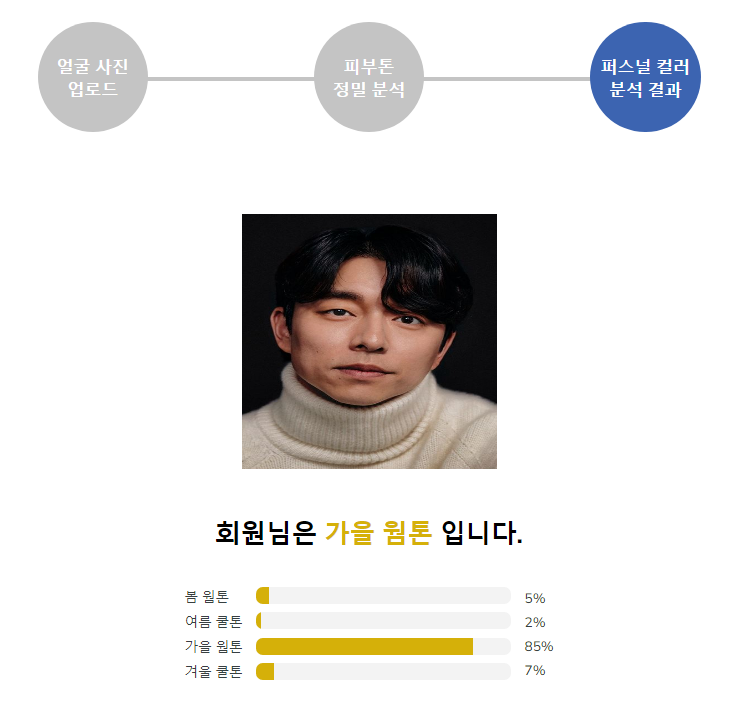
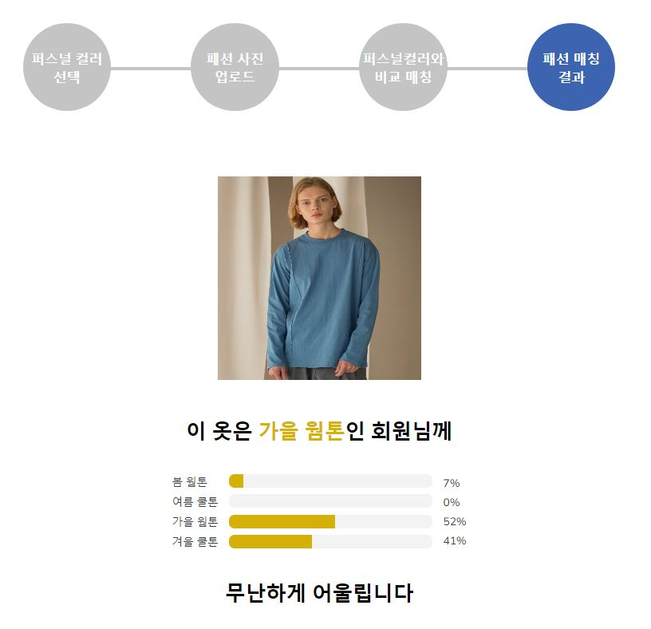
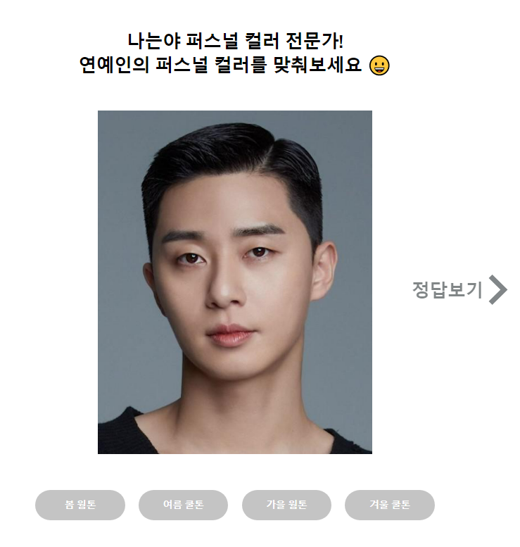

# ColorFit

AI가 제공해주는 나만의 퍼스널컬러 진단을 받아보고, 나에게 어울리는 옷 색상을 알아보세요!

## 1. 프로젝트 소개

Personal Color는 개인 고유의 신체색을 의미하며, 개인의 특성을 분석하여 퍼스널컬러 타입 분류체계의 한 타입에 개인을 대응시켜 그에 조화를 이루는 색을 진단하여 적합한 메이크업, 헤어, 의상 등의 색채 이미지를 연출하는 시스템입니다.

`ColorFit`은 사용자가 업로드한 사진을 딥러닝 모델을 적용하여 퍼스널컬러 타입을 진단하고, 진단 결과와 퍼스널컬러 팔레트를 기반으로 패션 매칭 서비스를 제공합니다. 기존에 사람의 눈에 의해 판단되었던 주관적인 퍼스널 컬러 타입의 진단 과정을 사용자에게 제공받은 사진을 통해 딥러닝 모델로 퍼스널 컬러 타입을 진단합니다.


## 2. 기술 스택

    

#### Back-end :         

#### Front-end :       

#### AI :   


## 3. 실행 방법(ubuntu 20.04 기준)

1. `docker` 설치 (https://docs.docker.com/engine/install/ubuntu/)

2. nvidia driver + `nvidia-docker2` 설치 (https://github.com/NVIDIA/nvidia-docker)

3. `git clone {repo http address}`

4. `colorfit/backend$ python3 -m venv env`로 가상환경 생성

5. `colorfit/backend$ source env/bin/activate`로 활성화

6. `colorfit/backend$ pip install -r requirements.txt`

7. 6에서 tensorflow나 다른 라이브러리가 없다는 에러가 날 경우 설치해도 되고, 해당부분은 주석처리하고 8번까지 실행한 후 다시 주석 해제하고 9번부터 실행

8. `backend/app/migrations/0001_initial.py` 없다면 `colorfit/backend$ python manage.py makemigrations`

9. `colorfit$ docker-compose up`

10. `colorfit$ docker-compose exec backend python manage.py migrate`

11. 접속!

12. `colorfit$ docker-compose down`으로 종료

13. 기타 추가해야할 사항
- kakao talk share api (https://ellismin.com/2020/09/share-kakao/)
- boto3, django storages 사용해서 aws s3와 연결 (backend/config/conf.py라는 파일을 생성하고 필요한 키 값들을 넣어준다. backend/config/settings.py 하단에서 사용된다)


## 4. 폴더 구조 개요
```
colorfit/ai => personal color training 과정 및 결과

# backend & ai
colorfit/backend => backend
colorfit/backend/app/ai => 실제 서비스에 사용되는 모델과 이미지 처리 로직이 들어있는 폴더
colorfit/backend/app/ai/color => personal color test 인공지능 모델
colorfit/backend/app/ai/fashion => fashion matching test 인공지능 모델
colorfit/backend/app/apps.py => 모델을 처음 한번만 로드할 수 있도록 메타데이터로 모델을 로드해 사용
colorfit/backend/app/serializers.py => serializer code (인공지능 모델 호출을 view가 아니라 여기서 실행)
colorfit/backend/app/views.py => view code (class based views)
colorfit/backend/config/conf.py => git ignored, aws 설정값

# frontend
colorfit/frontend => frontend
colorfit/frontend/public => html 파일, 폰트
colorfit/frontend/src/components => 페이지별 자주 쓰이는 스타일 컴포넌트, jsx
colorfit/frontend/src/image => 이미지, 아이콘
colorfit/frontend/src/pages => 하나의 페이지를 구성하는 큰 컴포넌트 모음
colorfit/frontend/src/utils => API 모듈, 커스텀 훅, 함수, recoil atom, 글로벌 스타일 등등

# docs
colorfit/docs => 개발하면서 참고할 문서정리    
```

## 5. 서비스 주요 기능 설명

  - 얼굴 사진을 업로드하면 퍼스널 컬러를 분석하여 '봄 웜톤', '여름 쿨톤', '가을 웜톤', '겨울 쿨톤'의 결과를 제공합니다.
  - 옷 사진을 업로드하면 옷과 각 계절별 톤과의 적합도를 persentage로, 사용자의 퍼스널 컬러와의 적합도를 세 가지 state로 제공합니다.

- 퍼스널 컬러를 맞춰보는 미니 게임을 제공합니다.

  


## 6. 프로젝트 팀원

| 이름 | 담당 업무 |
| ------ | ------ |
| 강주성 | 팀장/백엔드 개발 |
| 박수영 | 백엔드 개발 |
| 배경태 | 프론트엔드 개발 |
| 임미선 | 프론트엔드 개발 |
| 심소민 | 인공지능 개발 |
| 백승수 | 인공지능 개발 |


## 7. 프로젝트 상세 기획 내용

[프로젝트 기획서](https://kdt-gitlab.elice.io/ai_track/class_03/ai_project/team13/colorfit/-/wikis/home)

